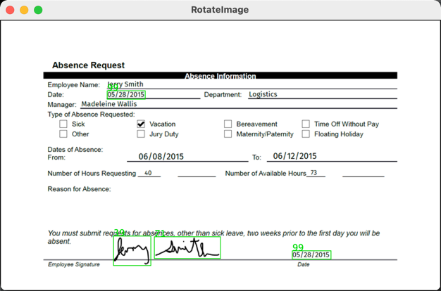

# AWS Textract Demo

## Description

In order to detect to signature and date, we used AWS API: AnalyzeDocumentRequest to analyze the 
document. The result from AWS contained not only signature and date info but also other text info, 
which we don't actually need. 

Analyzing the RELATIONSHIP in the result could help us concentrate on
the detection of signature and date. After the program finished analyzing the process, the detection 
detail will display in the terminal, and an image with bounding boxes will show up on the screen.

## Usage
Before running the program, make sure you have login AWS with AWS CLI, and uploaded target document.
(If you have access to AWS Account DocumentIntelligence, and want a quick start, feel free to run 
without startup arguments.)
```
mvn clean install
java -jar -Ddocument="{docment_name}[optional]" -Dbucket"{bucket_name}[optional]" target/aws-textract-demo-1.0-SNAPSHOT.jar
```

## Screenshot

## Terminal Result Sample
[Sample](terminal_result.text)

